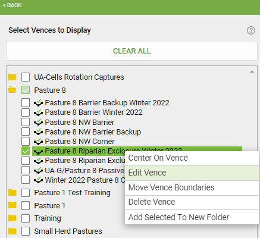
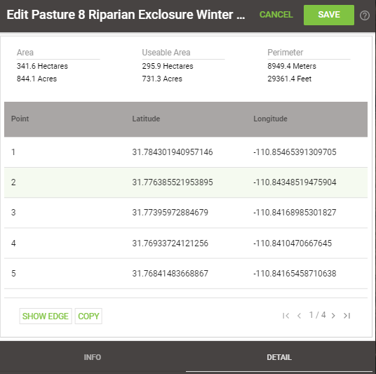
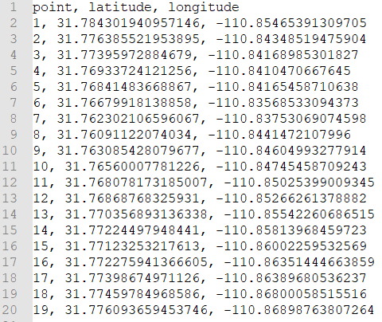
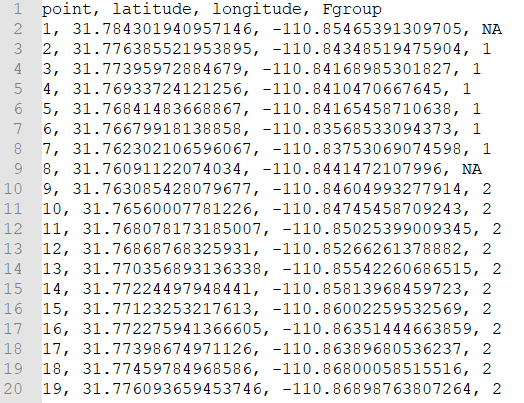
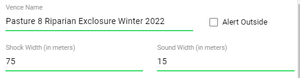

# VenceVFWrangling
Walkthrough for retrieving virtual fence coordinates from HerdManager Application and creating polygons of management zones. 

## getting fence coordinates
Select the Edit option for the virtual fence of interest on herdmanager

Copy the GPS coordinates into a notepad. 

The coordinates should paste into the note in a similar fashion as below. 

This is the outline of the entire shape of the fence. "Of note, the total vertices of the virtual fence appear to have no limit but the active fences are restricted to 16." 
This shapefile doesn't include the active fences. You'll need tag the active fences manually in the order listed in the "info tab" of the edit fence option. 

Note the active fences locations along the fence boundary, noted with "V"s 

 🠋 
  

Create a new column called "Fgroup" to assigning tags for each active fence. There may just be one, but this still needs to be tagged.  

### Prep
All virtual fences that are planned to be used should be processed in this method and stored in a file for RAW virtual fences upon completion. 

## Storing metadata

You'll need to manually store meta data associated with each fence. Pertinent information includes the Virtual Herd Name, the Fence Name, when the fence turned on and off, the width of the boundaries, and the type of fence used (exclosure or enclosure). 
Fence metadata should be added when the on and off date are uploaded to a herd. 

| Herd | Fence | On  | Off | Shock | Sound | Objective | ExclType |
| ---- | ----- | --- | --- | ----- | ----- | --------- | -------- |
|Small Herd 2022-06-22|Vence Training Day 1|6/28/2022 0:00|6/29/2022 0:00|25|0|Training|In|

